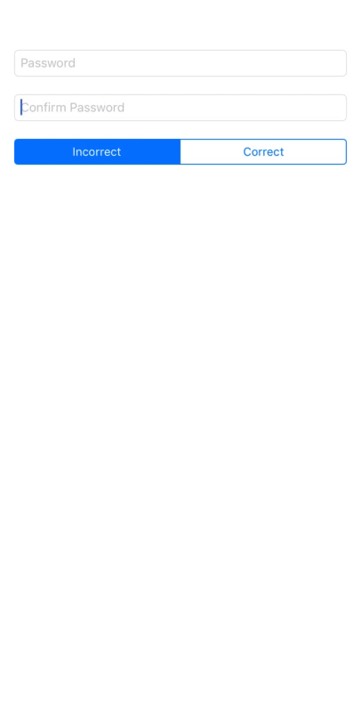

An expressive and extendible way of validating input.

## Example

```swift
InputValidator<String>()
.isEqualTo { confirmPasswordField }
.isValidLength { $0 >= 8 }
.hasAlphaCharacters()
.hasNumericCharacters()
.validate(input: password)
```


